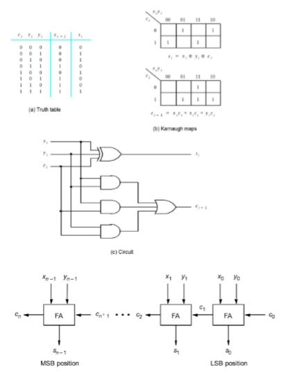

# Circuitos compilados na Placa

## VHDL de Circuito Full Adder de 4 Bits com Dysplay de 7 Segmentos
Sintetizar na placa, um circuito que gere a soma de 2 números inteiros, sem sinal, de 4
bits (soma= a + b). Configure o circuito com quatro somadores full adder (somador
completo - full adder – feito na Atividade 4), ligados em série (Ripple Carry ver DICA 2).
As entradas devem ser SW8 a SW5 para a entrada a, SW4 a SW1 para a entra b e SW0
para o cin. As entradas e as saídas devem ser mostradas displays de 7 segmentos (HEX7
<– cout, HEX5 <- soma, HEX3 <- a, HEX1 <- b e HEX0 <- cin)

