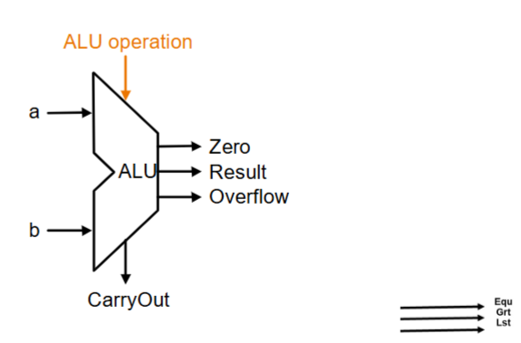
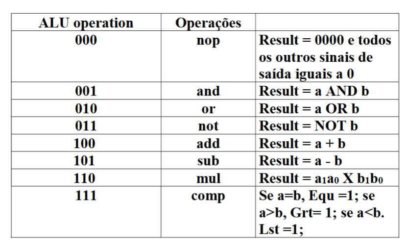
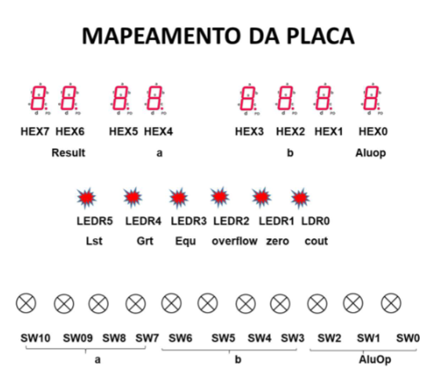

# Projeto ULA

## VHDL de Circuito para uma ULA (Unidade de Lógica Aritmética)
### Projetar uma Unidade Lógica e Aritmética – ALU (Arithmetic Logic Unit), que faça as seguintes operações:
- ADD e SUB – Implementar um somador/SUBTRATOR ripple carry de 4 bits.
- MULTIPLICAÇÃO – Implementar um multiplicador de 2 números de 2 bits. A multiplicação deverá ser feita como os dois bits menos significativos de cada entrada, formando então, um número de 4 bits.
- AND – Implementar um circuito que faça a operação AND entre 2 números de 4 bits, bit a bit.
- OR – Implementar um circuito que faça a operação OR entre 2 números de 4 bits, bit a bit.
- COMPARAÇÃO – Implementar um circuito que compare 2 números de 4 bits cada e diga se o primeiro é igual (EQU) maior(GRT) ou menor (LST) que o segundo.
#### A organização da ULA pode ser vista na imagem e na tabela abaixo:

- Saída Zero será 1 (LED acesso) quando Result = 0000, caso contrário será 0.
- A saída Overflow será 1 quando ocorrer overflow na soma ou subtração (operações sinalizadas).
- A saída CarryOut será o carry out das operações de ADD e SUB.
- ALUOperation escolherá qual das saídas das operações deverá ser direcionada para Result.
- Além das saídas mostradas no desenho, deverão ter mais 3 saídas que mostrarão o resultado da comparação. Uma será a Equ que será 1 se a e b forem iguais, caso contrário será 0, a outra será Grt que será 1 de a for maior que b, caso contrário será 0 e por fim Lst que será 1 se a for menor que b, caso contrário será 0.

##### Observações importantes:
###### O projeto deverá usar componentes e package, da seguinte maneira:
- Componentes e package
- Somador completo
- Somador de 2 números de 4 bits
- Multiplicador de dois números de 2 bits
- Comparador
- A subtração, o AND, o NOT e o OR, devem ser feitos junto com o circuito principal - ULA

##### MAPEAMENTO DAS ENTRADAS E SAÍDA NA PLACA
- a => SW10 a SW7
- b => SW6 a SW3
- AluOp => SW2 A SW0
- HEX0 => AluOp
- HEX2 => b
- HEX4 => a
- HEX6 => result
- LDR0 => cout
- LDR1 => zero
- LDR2 => overflow
- LDR3 => Equ
- LDR4 => Grt
- LDR5 => Lst

